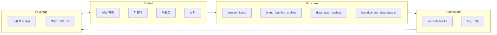

# BRICLOG Data Asset Flywheel

구독료를 넘어 **고객 데이터 자산**이 경쟁사가 복제하기 어려운 해자(moat)입니다.  
이 문서는 수집 → 구조화 → 복리 → 보호 → 활용 → 운영 가시성의 흐름을 정의합니다.

## Flywheel



| 단계 | 역할 | 주요 저장소 |
|------|------|-------------|
| Collect | 생성·피드백·복사·성과 수집 | `content_items`, `content_feedback`, `content_events`, `content_performance` |
| Structure | `user_id` → `brand_id` → 콘텐츠·피드백 RLS 격리 | v3–v8 스키마 + **v12** `brand_data_assets`, `data_asset_registry` |
| Compound | 프로필·롤업·전역 인사이트 갱신 | `recomputeBrandLearningProfile`, `compoundDataAssetsNightly` |
| Protect | RLS, PII sanitize, 관리자만 집계 export | `sanitizeLogText`, `/api/data-asset/export` (admin only) |
| Leverage | 다음 초안 품질·전환 비용 | `loadPersonalizationLayers` + `buildDataAssetPromptAddon` |
| Admin | 자산 건강 (원문 없음) | `/admin` · `fetchDataAssetHealth` |

## 코드 모듈 (`lib/dataAsset/`)

| 함수 | 용도 |
|------|------|
| `recordGenerationAsset()` | `POST /api/memory/content` 후 레지스트리 + 롤업 |
| `recordFeedbackAsset()` | `POST /api/feedback/submit` 후 레지스트리 + 롤업 |
| `getBrandAssetSummary(brandId)` | 프롬프트·UI용 요약 (원문 없음) |
| `compoundDataAssetsNightly()` | `runDailyDevelopPipeline` 야간 복리 |
| `fetchDataAssetHealth()` | 관리자 대시보드 집계 |

## 스키마 적용

Supabase SQL Editor에서 순서대로 적용 후, **v12** 실행:

```
supabase/schema-v12-data-assets.sql
```

- `brands.brand_data_assets` — JSONB 롤업 (건수·채널·품질·학습 시각)
- `data_asset_registry` — append-only 이벤트 (summary만, PII 없음)

## 연동 지점

1. **생성 저장** — `app/api/memory/content/route.js` → `recordGenerationAsset`
2. **피드백** — `app/api/feedback/submit/route.js` → `recordFeedbackAsset`
3. **야간 크론** — `lib/cron/dailyDevelopPipeline.js` → `compoundDataAssetsNightly`
4. **프롬프트** — `lib/memory/personalizationBrief.js` → `getBrandAssetSummary` / `dataAssetBrief`
5. **UX** — `BrandMemoryPanel`: 「이 브랜드에 쌓인 기록은 계속 이어집니다」

## Export 정책

- **일반 사용자**: raw 데이터 덤프 API 없음. `POST /api/data-asset/export` → 403.
- **관리자**: `GET /api/data-asset/export` — 집계형 `health`만 (원문·PII 없음).
- 외부 판매·제3자 공유 코드 경로 없음.

## GDPR / 삭제 권리

- 계정·브랜드 삭제 시 `ON DELETE CASCADE`로 연관 행 제거 (`user_id` / `brand_id` FK).
- 데이터보내기 요청은 고객센터·설정 경로로 처리 (자동 bulk export 미제공).
- 로그·레지스트리 `summary`는 `sanitizeLogText`로 이메일·전화·카드 패턴 마스킹.

## 운영 가치 (한 줄)

**브랜드가 쓸수록 초안이 그 브랜드에 맞춰지고, 기록이 이어져 이탈 비용이 커진다** — 구독이 아니라 **쌓인 자산**이 이유입니다.
